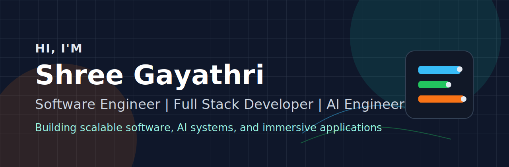
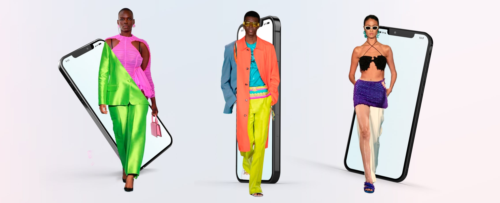

  

  

  
  
  

  

## About Me

- Building full-stack applications with React, TypeScript, Node.js, REST APIs, and cloud-backed databases.
- Exploring AI engineering through LLM applications, RAG systems, AI agents, and model evaluation.
- Interested in scalable backend systems, clean APIs, automation, and useful product experiences.
- Comfortable working across frontend, backend, AI, AR/MR, cloud, and developer tooling.

## Tech Stack

  

 

  
  
  
  
  

## Featured Projects

<table align="center" width="100%" cellpadding="0" cellspacing="0">
  <tr>
    <td width="50%" valign="top">
      
      <h3>ProArcade</h3>
      
AI-powered gamified productivity platform with task workflows, persistent game sessions, cloud media storage, and multimodal verification.

      

        <strong>Tech:</strong> React, TypeScript, Node.js, PostgreSQL, Prisma, AWS S3, Amazon Bedrock
      

      

        <a href="https://github.com/shree2402/ProArcade">View Repository</a>
      

    </td>
    <td width="50%" valign="top">
      
      <h3>AR Virtual Try-On</h3>
      
AR-enhanced shopping experience with 3D product previews, AI-powered try-on flows, and scalable product data workflows.

      

        <strong>Tech:</strong> JavaScript, Bootstrap, Supabase, Hugging Face, WebXR, Model Viewer
      

    </td>
  </tr>
</table>

## Impact Metrics

<table>
  <tr>
    <td align="center" width="20%"><strong>100+</strong> Products Supported</td>
    <td align="center" width="20%"><strong>1,000+</strong> QA Samples Tested</td>
    <td align="center" width="20%"><strong>30%</strong> Stability Improvement</td>
    <td align="center" width="20%"><strong>20%</strong> Lower AI Latency</td>
    <td align="center" width="20%"><strong>25ms</strong> Eye Tracking Latency</td>
  </tr>
</table>

## Currently Learning

  
  
  
  
  

## Fun Facts

<table>
  <tr>
    <td width="25%" align="center">I enjoy building AR/MR experiences.</td>
    <td width="25%" align="center">I like turning AI ideas into usable products.</td>
    <td width="25%" align="center">I care about clean APIs and reliable systems.</td>
    <td width="25%" align="center">Hot Chocolate plus coding keeps the build moving.</td>
  </tr>
</table>

## Connect With Me

  
  
  

